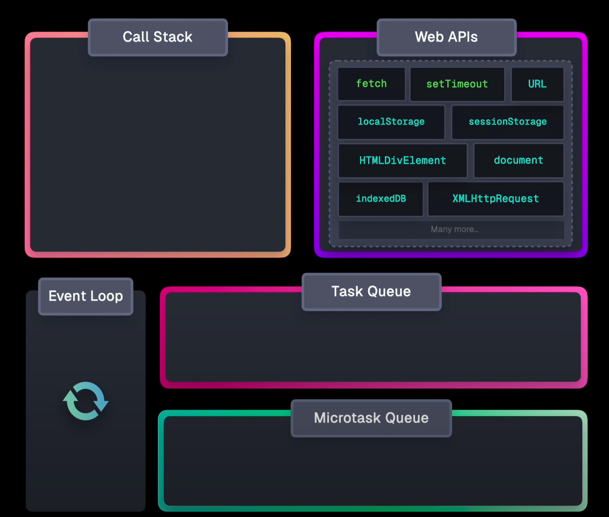
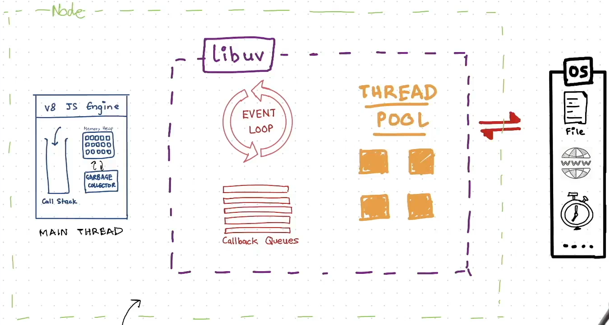

### Synchronous Vs Asynchronous execution

-   **Synchronous execution:**

    -   Tasks execute sequentially, one after another
    -   Each task must complete before the next one begins
    -   Blocking in nature - the program waits for each operation to complete
    -   Single-threaded execution is sufficient

-   **Asynchronous execution:**

    -   Multiple tasks can run simultaneously (multiple operations at a time).
    -   Non-blocking in nature - program continues execution while waiting for operations
    -   At least more than one thread is required.
        -   This can be achieved through concurrency or parallelism.

**NOTE:**

-   Javascript (JAVASCRIPT ENGINE) is synchronous, single-threaded (i.e., Javascript engine can run only one operation at a time)

### How Javascript shows Asynchronous behaviour?

-   Runtime environments provide the ability to handle asynchronous tasks to the Javascript engine.

    -   **Browser Runtime** provides event loop, callback queue, microtask queue and browser API's (like [Fetch API](https://developer.mozilla.org/en-US/docs/Web/API/Fetch_API), [Geolocation API](https://developer.mozilla.org/en-US/docs/Web/API/Geolocation_API) etc.)
    -   **Node Runtime** provides libuv library with event-driven architecture.

-   Following are considered as async tasks in javascript

    -   I/O tasks
        -   File operation
        -   Network calls etc.
    -   Timer
        -   Javascript does not have built-in timers; it relies on the runtime to provide them.

-   Browser Runtime Architecture

    

-   Node.js Architecture

    

### Simple workflow of handling async tasks

1. Main Thread (Synchronous)
    - Executes Javascript code line by line
    - When it encounters async tasks, delegates them to runtime
2. Runtime environment
    - Handles async tasks separately (not on the main thread)
    - Browser Runtime:
        - Handles the tasks using browser API's
        - Puts completed tasks in callback queue/microtask queue
    - Libuv:
        - Handles the task using Libuv's libraries and thread pool
        - Puts completed tasks in callback queue/microtask queue
3. Event Loop
    - Continuously checks if the main thread is idle.
    - Moves callbacks from queue to main thread.

### Simple Async code execution

```js
const fs = require("fs");
const https = require("https");

console.log("Hello World");

var a = 987654321;
var b = 123456789;

https.get("https://dummyjson.com/products/1", (res) =>
    console.log("Data Fetched Successfully")
);

setTimeout(() => {
    console.log("setTimeout called for 5 sec");
}, 5000);

fs.readFile(__dirname + "/file.txt", "utf-8", (err, data) => {
    if (err) throw err;
    console.log(data);
});

function multiply(a, b) {
    return a * b;
}

var c = multiply(a, b);
console.log(c);

console.log("End of sync execution");
```

**Output:**

```
HelloHello World
121932631112635260
End of sync execution
Hello World! I am chitti, Speed: 1 Terra Hertz, Memory: 1 Zeta Byte
Data Fetched Successfully
setTimeout called for 5 sec
```

### What is libuv library

-   [`libuv`](https://libuv.org/) is an open-source cross platform C library that provides support for asynchronous I/O based operations. Originally designed for Node.js
-   Features of libuv

    -   Event Loop
    -   Thread Pool
    -   Asynchronous I/O
    -   Cross platform compatibility

### How Node.js is utilizing libuv to achieve Async I/O?

### What is libuv's thread pool?

TODO:

### Why the term "Asynchronous I/O"

-   All the I/O tasks are delegated to libuv and it executes them asynchronously using thread pool, so they get executed parallelly with main thread, hence Async I/O.
-   This Asynchronous I/O nature leads to Non-Blocking I/O nature.

### Why the term "Non-Blocking I/O"

-   Since all the I/O tasks are delegated to libuv and running on thread pool leaves main thread unblocked with I/O tasks.
-   None of the I/O tasks are blocking the main thread, hence Non-Blocking I/O

### Why Non-Blocking I/O is advantageous?

-   Usually all I/O tasks makes CPU sit idle until they receive response which is wastage of resources.
-   Since Javascript is single threaded until the current request is resolved no other requests will be served (assumin you are running only one server instance)

# Appendix

### What is callback queue (task queue)?

-   After executing I/O tasks, JavaScript runtimes add them to the callback queue.
-   The event loop then picks these tasks from the callback queue and adds them to the call stack.

### Callback queue vs Microtask queue

-   Task queue handles
    -   setTimeout/setInterval callbacks
    -   I/O operations
-   Microtask queue handles
    -   Promise callbacks
-   Microtask queue has higher priority, task queue will only be handled if microtask queue is empty.

### Concurrency Vs Parallelism

**Concurrency:**

-   Multiple threads take turns executing on a single processor core
-   Tasks are managed through context switching - the processor switches between threads
-   Can be achieved on a single core processor
-   Threads appear to run simultaneously but are actually taking turns

**Parallelism:**

-   Multiple threads execute simultaneously on different processor cores
-   No context switching needed between parallel threads
-   Requires multi-core processor hardware
-   Threads truly run at the same time independently

|                                                                                                                                                                       |                               |     |
| --------------------------------------------------------------------------------------------------------------------------------------------------------------------- | ----------------------------- | --- |
| [PREV: Chapter 05 - Diving into the Node.js github repo](../Chapter%2005%20-%20Diving%20into%20the%20NodeJS%20github%20repo/05_diving-into-the-nodejs-github-repo.md) | [Back to index](../README.md) |     |
